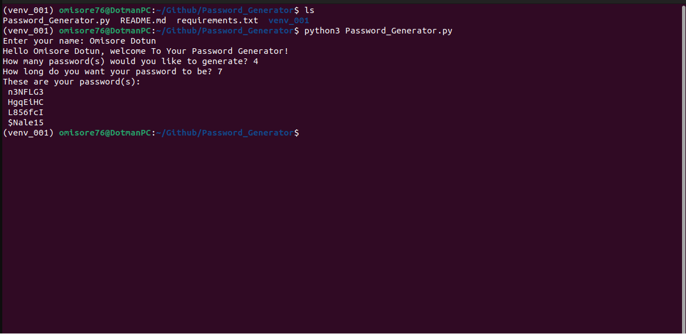

# Password_Generator

## Introduction

If you're like most people, you probably have a hard time coming up with unique passwords that are both strong and easy to remember. But with this handy Python script, you can generate secure passwords that are customized to your specifications. 

Simply enter the number of passwords you need and the desired length, and the script will do the rest. The generated passwords will be complex and difficult to crack, but they'll also be easy for you to remember because they'll be based on information that's specific to you. So go ahead and give it a try - your online security depends on it!



## Prerequisite
- Python3 installed on your local address

## How to Use This Repo

- Fork the repo

- Clone it on your local machine

- While in the project repo on your local machine, create a virtual environment. Run the code below to create a virtual environment
```
	python3 -m venv venv_001
```
- Activate the virtual environment
```
	source venv_001/bin/activate
```
- Install requirements
```
	pip install -r requirements.txt
```
- Run the app
```
	python3 Password_Generator.py
```
- Enter the number of password(s) needed, as well as the desired length of your password

- Finally, deactivate the virtual environment once done 
```
deactivate
```
## Tips

Feel free to edit the code to suit your needs!
